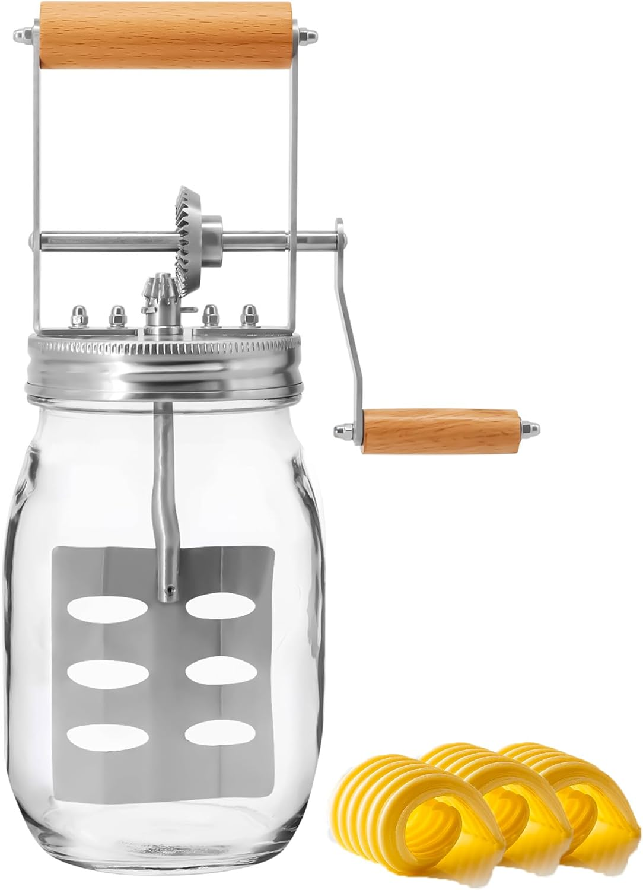
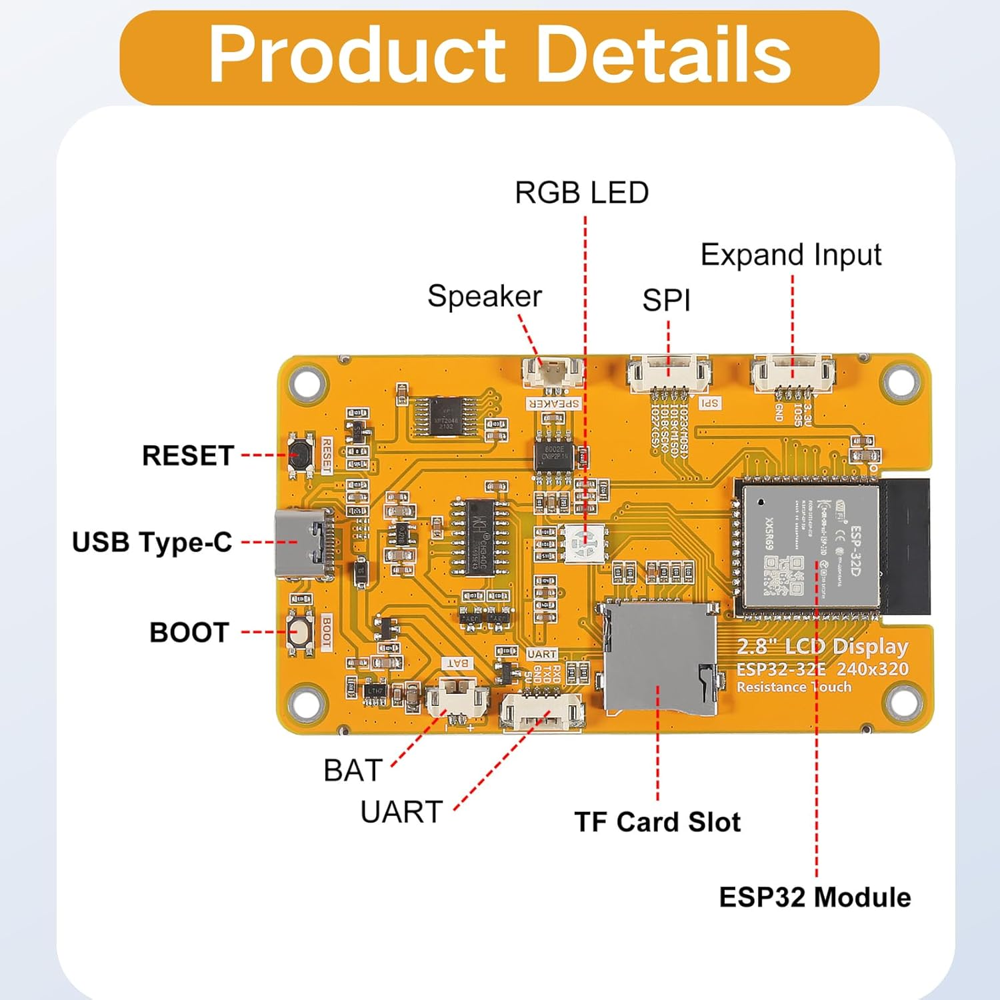
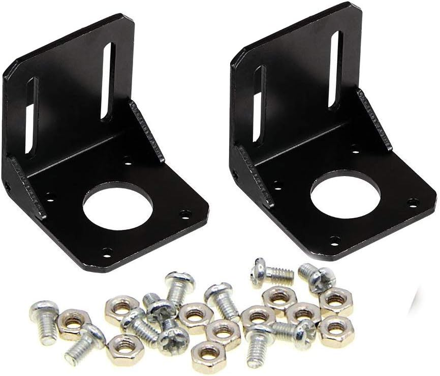
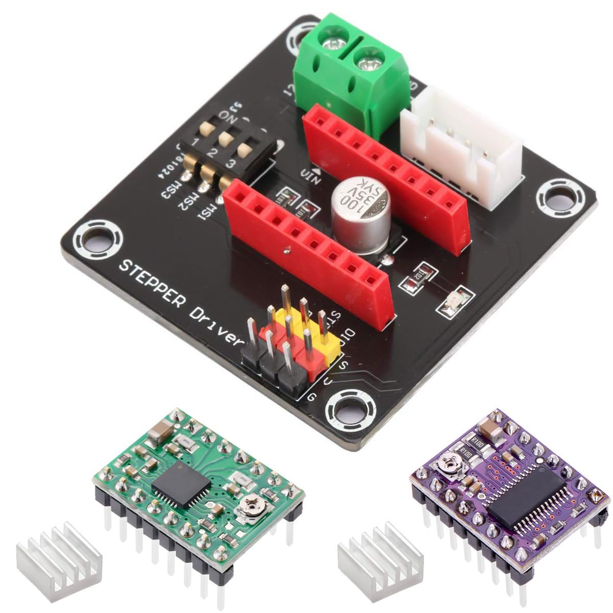
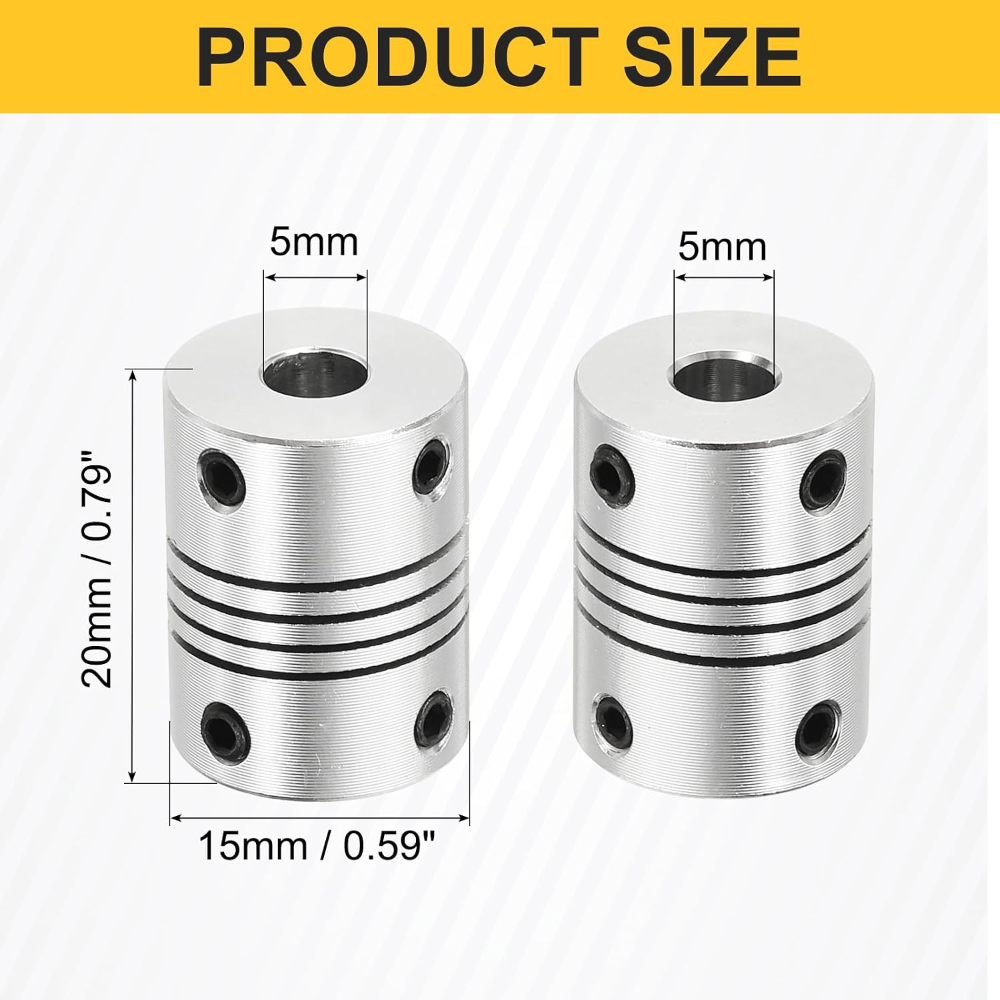
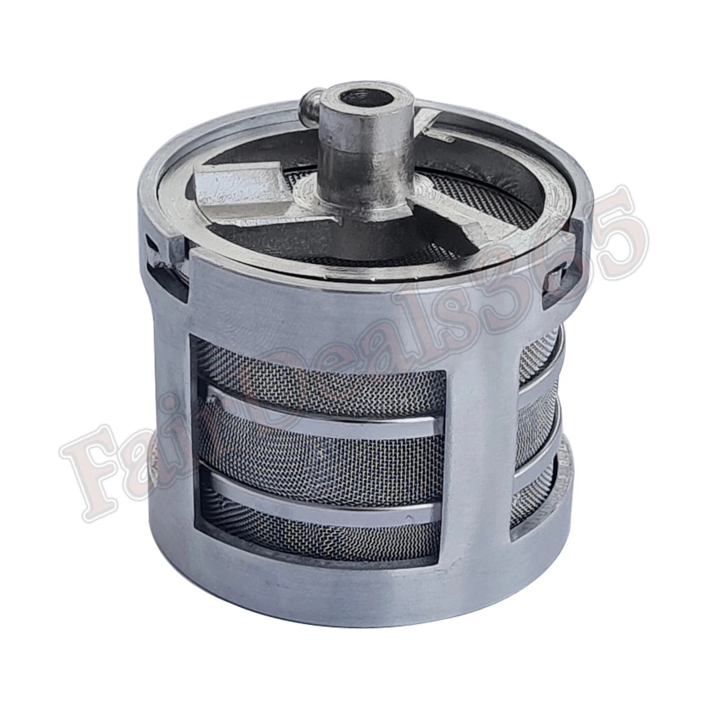
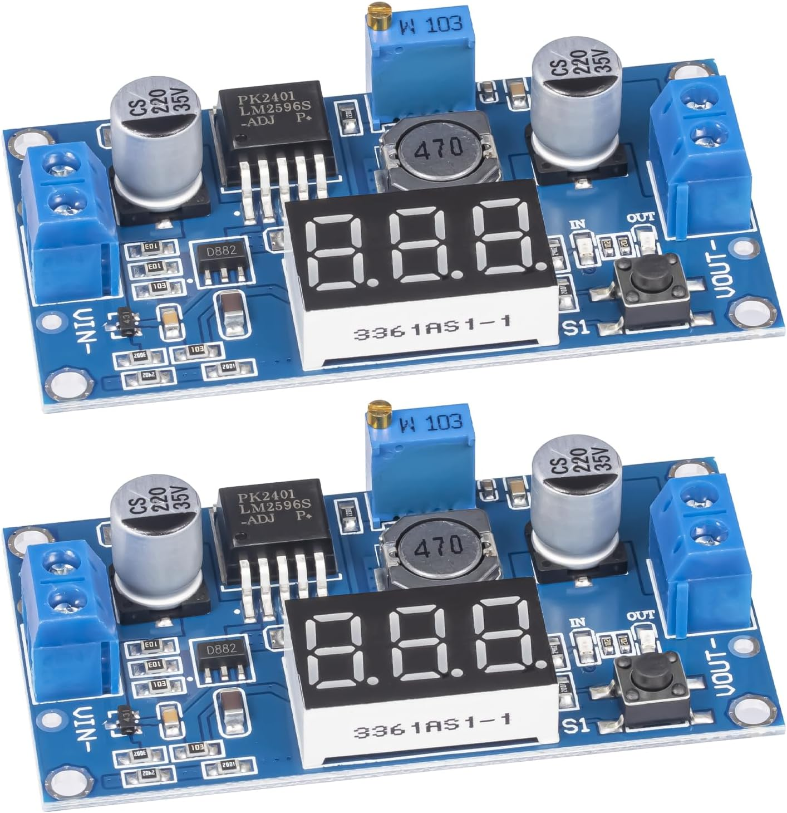
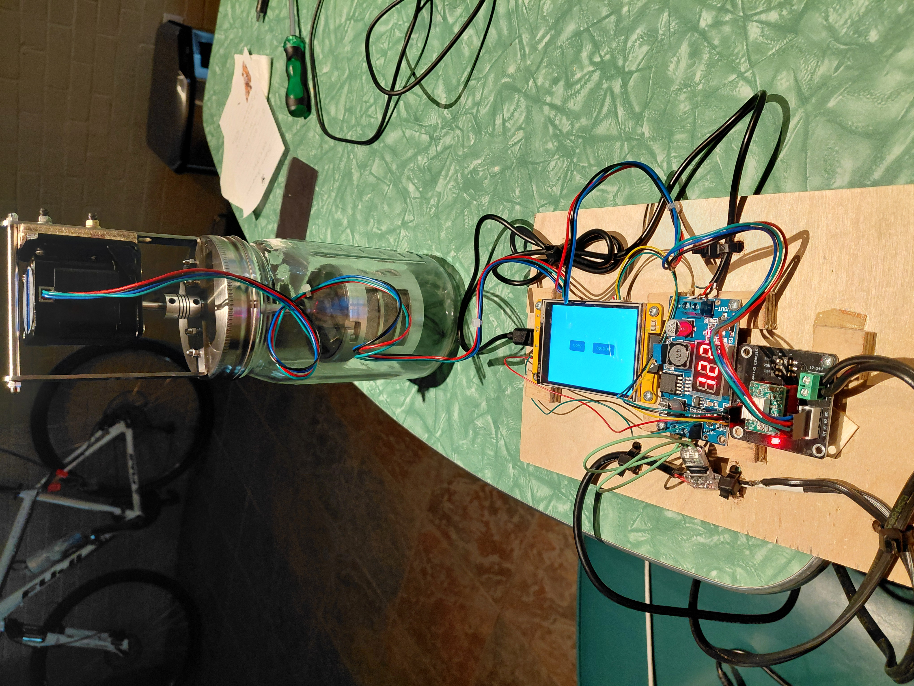
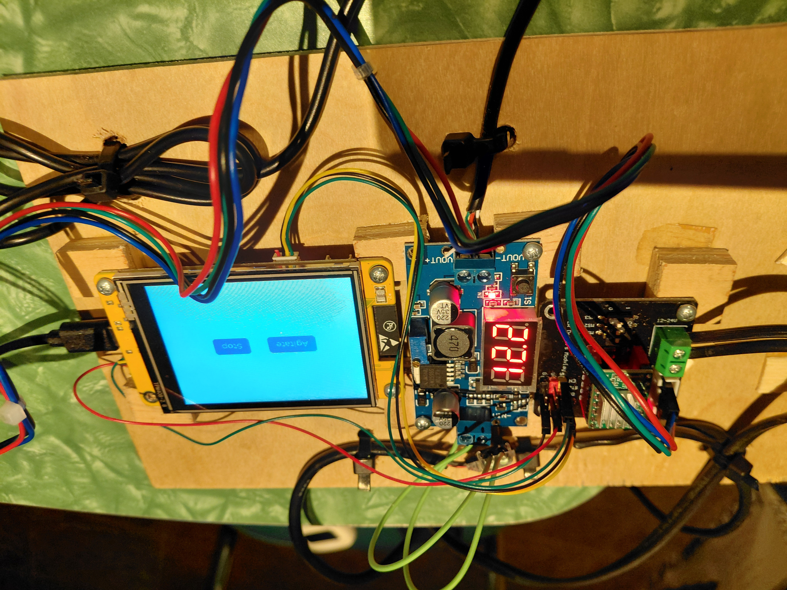

# Watch Part Washer
Relatively inexpensive watch part washer made from off the shelf parts.\
My buddy Frank says I over engineered it i.e. stepper motor wasn't necessary etc... I did it because I could get parts like the L bracket that simplified construction. So it probably can be done cheaper. I tried to upload a video of it working but it was to big :(

## Parts
* Premium Butter Churner – Makes Fresh Homemade Butter in 10 Minutes | 32oz Glass Jar with Stainless Steel Paddle | Hand Crank Butter Maker | Easy to Use & Clean | Perfect for Family Kitchen Fun
https://www.amazon.com/dp/B0C1Z4KVRW?ref=ppx_yo2ov_dt_b_fed_asin_title 

* ESP32 Display 2.8 inch, ESP32-32E WiFi+BT Dual-core TFT Module with Acrylic Case, ESP32 Development Board ILI9341 Driver 240X320 Smart LCD Display Screen for Arduino IOT
  https://www.amazon.com/dp/B0FCXTPCQ6?ref=ppx_yo2ov_dt_b_fed_asin_title&th=1 

* 42mm Stepper Motor Mounting L Bracket with M3 Screw +Gasket(2Pcs)
  https://www.amazon.com/dp/B07HN8ZS8W?ref=ppx_yo2ov_dt_b_fed_asin_title []
* DAOKAI 42 Stepper Motor Driver Expansion Board DRV8825 A4988 3D Printer Control Shield Expansion Module with A4988 + DRB8825 Stepper Motor Driver, for 3D Printer
  https://www.amazon.com/dp/B0CR3ZD91Y?ref=ppx_yo2ov_dt_b_fed_asin_title 

* STEPPERONLINE Nema 17 Stepper Motor Bipolar 2A 59Ncm(84oz.in) 48mm Body 4-Lead W/ 1m Cable and Connector Compatible with 3D Printer/CNC
https://www.amazon.com/dp/B00PNEQKC0?ref=ppx_yo2ov_dt_b_fed_asin_title
* uxcell 4Pcs Flexible Couplings 5mm to 5mm Aluminum Alloy Joint Connector, Flexible Shaft Couplings Motor Coupler for 3D Printer CNC Machine Motor Guide DIY Encoder D15 x L20mm
  https://www.amazon.com/dp/B0G495NCLC?ref=ppx_yo2ov_dt_b_fed_asin_title&th=1 

* Basket Watch Cleaning Machine DIA 6.9cm HEIGHT 5.8cm Stainless Steel https://www.ebay.com/itm/297472559245 

* LM2596 LM2596S DC-DC Buck Converter Voltage Regulator Adjustable 4.0-40V to 1.25-37V 2A Power Supply Module with LED Voltmeter Display (Pack of 2) https://www.amazon.com/dp/B0D2TS7CBN?ref=ppx_yo2ov_dt_b_fed_asin_title&th=1 

* Old 12v power supply
  

  

## Build

I did look at 3d printing the basket (https://www.thingiverse.com/thing:5905166) but I don't have a printer or easy access to one. I considered using https://www.pcbway.com/ which was actually not that expensive but in the end I just went with the basket on ebay.  
I like to write Python so I built https://github.com/lvgl-micropython/lvgl_micropython for the ESP32 CYD board and flashed it using Thonny.  
I only wanted to have 1 plug so I used the Buck Converter Voltage Regulator to convert 12v from the power suppy to 5v for the CYD 5v power see (https://www.yuxun.com/how-to-wire-a-usb-c-cable-for-power.html) and 12v to the stepper expansion board for the motor.  
1. Disassemble churner mechanism removing the gears and crank handle. Take the gear off the churner shaft by removing the cotter pin.
2. Remove one of the L brackets bolted to the lid of the churner.
3. Drill matching holes in one of the churner L brackets and the motor mount L bracket along with a strip of 1/2in plywood. The plywood goes between the motor L bracket and the churner L bracket to align the motor shaft with the churner shaft. When drilling the stainless steel churner L bracket use a spray bottle with water in ti to cool the metal this makes the drilling easier. I used a drill press to drill the holes.
4. Use some small button head bolts to connect the motor mount to the churner L bracket with the plywood sandwiched in between.
5. Attach the motor to the mount
6. Attach a flexible coupling on the motor shaft. Slide the coupling on to the motor shaft until it is about halfway into the coupling and tighten the allen screws
7. Attach the motor assembly to the churner. Slide the end of the churner shaft through the lid into the coupling and tighten the allen screws.

